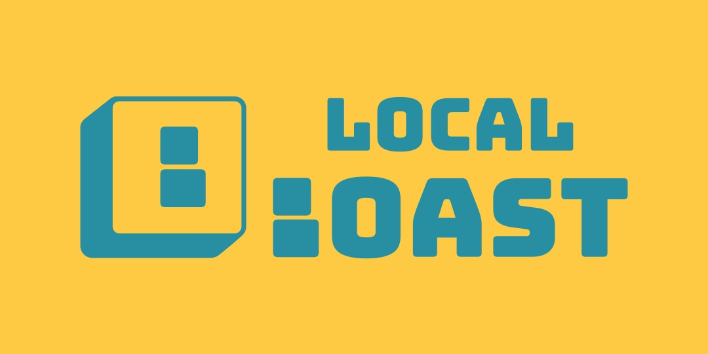

<!--- Autogenerated Readme. Do not edit. Edit the templates or config files instead. --->
# LocalBoast - Utils



Install the entire module as a dependency from npm as normal:

```bash
npm i localboast
```

or

```bash
yarn add localboast
```

**Note**: As this library is intended to be all-inclusive, it has no dependencies other than peer-dependencies of `react` and `react-dom`. This means it should have minimal compatibility issues with any app.

# Contents


# To Use

Each of the links in the [Contents](#contents) table above has a dedicated Readme explaining usage of the particular function.

All of these utils are exported from the root index, allowing for cleaner imports like:

```javascript
import { cx } from "localboast"
```

They can also be imported specifically from the `utils` directory as below

```javascript
import { cx } from "localboast/dist/utils"
```

## Docs/Example

This library is developed and documented through storybook.
A static build of this storybook app can be found at https://LocalBoast.com/docs
(Note: that entire website is built as a showcase of sorts for the LocalBoast library, but the `/docs` route is a direct embed of the full storybook app).

While I intend on keeping the above public build up to date with the functionality of this library, I cannot guarantee that it'll always be up to date. If you need docs for the latest and greatest, you can run it locally by cloning this repository and running `yarn run storybook`

## Live Development

In an attempt to be somewhat unique, the development of this project is largely happening live on stream over on [Twitch](https://twitch.tv/localboast1) or on [YouTube Live](http://youtube.com/channel/UCt-IaL4qQsOU6_rbS7zky1Q/live). A record of all past live streams and other video documentation can also be found at the above YouTube channel.

## Donations

I'm working on this instead of having a job that pays me. So for the time being, I'm going to be funded through generosity alone. If you're feeling generous, here are some links:

- Buy me a Coffee (Ko-fi - will show up on stream if I'm live): https://ko-fi.com/localboast
- Patreon: https://patreon.com/LocalBoast

## License

MIT © [ConorKelleher](https://github/com/ConorKelleher)
